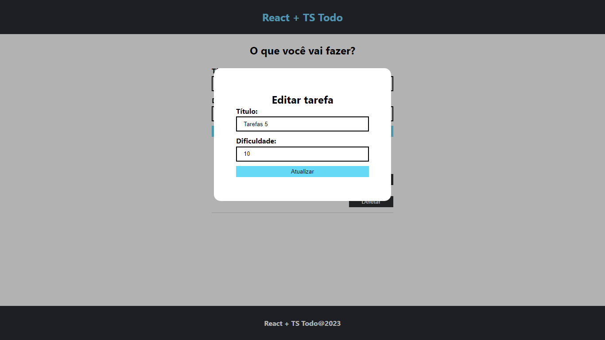

## Cadastro de tarefas local - React + Typescript

As tarefas registradas ficam armazenadas no próprio app, ou seja se F5, a lista de tarefas vai ser limpada

<b>Tela príncipal</b>

<b>Edição de tarefa</b>

## Licença 

Este projeto está licenciado sob a [Licença MIT](LICENSE).